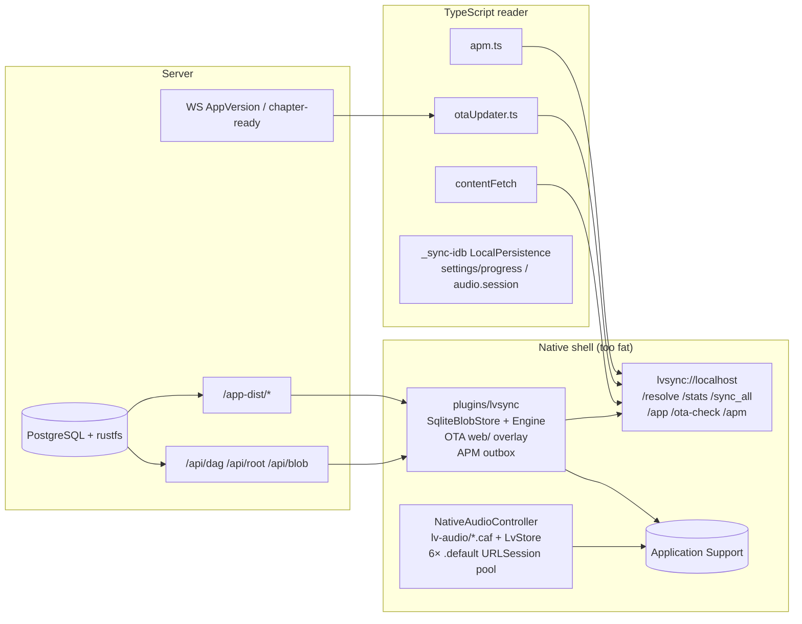
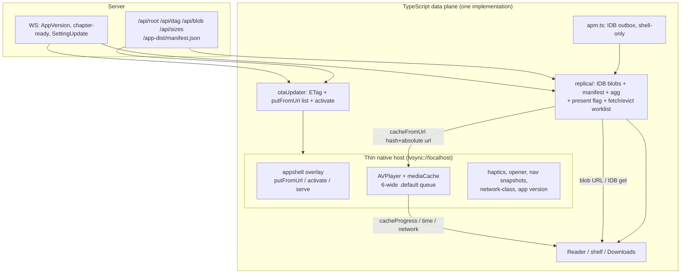
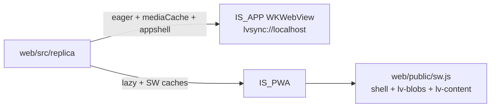

# LiveView thin-native + IndexedDB storage + TypeScript OTA reload

| Field | Value |
|---|---|
| **Status** | Accepted (rev 4). Storage ownership landed in the thin-native series. Host boot deletes leftover sqlite/`dag.json`; `/legacy-index` and `/legacy-wipe` are gone. Present-tense "current state" sections below are the pre-cutover decision record. |
| **Author** | LiveView |
| **Date** | 2026-08-21 |
| **Supersedes (storage ownership)** | [docs/offline-first.md](../offline-first.md) §5 (native blob store), [docs/offline-first-plan.md](../offline-first-plan.md) P3 native store, [docs/offline-rearchitecture.md](../offline-rearchitecture.md) (SQLite + Rust plugin as source of truth), [docs/ota-optimization.md](../ota-optimization.md) (plugin-owned app-root store) |
| **Does not supersede** | [docs/core-requirements.md](../core-requirements.md) (product gate), Merkle DAG identity of covers/backdrops, native ownership of background audio / lock-screen, protocol compatibility rule (version stays 1), SW-on-iOS rejection, O(1) Downloads stats, `lvsync://localhost` origin |

---

## Overview

**Landed.** The TypeScript IndexedDB replica (`web/src/replica/`) is the only content Merkle DAG replica. Native is a thin `lvsync://localhost` host (protocol v1): app-shell overlay, bounded media cache, AVPlayer. `lv-sync/` and `plugins/lvsync/` are deleted. Host boot deletes leftover `lvsync.sqlite` / `dag.json` / `_pins.json`; audio `.caf` files stay. This file is the decision record; "current state" sections below describe the **pre-cutover** tree.

Before the cutover, LiveView's native iOS/macOS shell owned too much: a Rust Merkle replica (`lv-sync/` + `plugins/lvsync/`), a SQLite content-addressed blob store, an OTA app-bundle overlay served at `lvsync://localhost/app/`, an APM SQLite outbox, a Swift audio file cache with its own SQLite index (`LvStore.swift`), and the download/retention/stats machinery that feeds Settings → Downloads. The TypeScript reader was a client of that native data plane via `contentFetch` (`web/src/native-sync.ts`) and `lvsync://` scheme fetches.

This refactor **reversed storage ownership**. IndexedDB in TypeScript is the only replica of the content Merkle DAG, the only place retention/GC/stats/APM/reader-state live, and the owner of app-shell update detection and apply. Native shrinks to the capabilities WKWebView and a PWA cannot provide — AVPlayer lock-screen audio, now-playing / widgets, snapshot navigation, haptics, URL opening, network-path, a generic app-shell file overlay, and a generic media playback cache with a **bounded URLSession pool** — behind a **stable, versioned, LiveView-agnostic host API**.

The product intent matches Cowboy's frontend rule: shipping a new TypeScript bundle reloads the running app automatically; SideStore / App Store reinstall is required **only** when the native binary itself changes (`web/src/_shell/native-release-update.tsx`). Native binary changes in this series are **batched into one IPA**.

Three platform constraints make a naive "everything in IndexedDB, zero native files, rename the scheme" design fail the [core requirements](../core-requirements.md):

1. **AVPlayer cannot play bytes that live only in IndexedDB.** Lock-screen / background / AirPods playback must stay on native AVPlayer (WebKit #198277 / #204261, cited in `web/src/native-audio.ts`). The JS bridge must not carry corpus-sized payloads (`docs/core-requirements.md`: constant-size bridge messages).
2. **WKWebView cannot boot a SPA from IndexedDB.** Cold launch happens before TypeScript runs. Today's `lvsync://localhost/app/index.html` (`app/src-tauri/tauri.conf.json`) exists for this reason.
3. **The document origin is the persistence contract.** `_sync-idb` (`audio.session` in `web/src/audio/stores.ts`), `_store` `persisted()` localStorage, `lv.audioMediaIndex.v1`, `lv.remote.origin`, and download prefs already live on `lvsync://localhost`. Renaming the scheme to `lvhost://` would wipe them.

The design therefore **keeps the scheme name `lvsync://localhost`** and treats two tiny native file maps as **generic host primitives**, not as "the store": an app-shell overlay (opaque hashed assets + current `index.html`, **fetched by native from baked origins**) and a media playback cache (hash → local file URL, filled by a **capped 6-wide `.default` URLSession pool** from a URL TypeScript already decided to fetch). Native has no Merkle, no DAG, no Downloads stats, no OTA policy, no APM.

---

## Background & Motivation

### Pre-cutover state (verified in the tree this design started from)

Live SPA I/O used the **custom-scheme handlers**, not the unused Tauri `invoke` commands (`generate_handler![resolve, sync_all, cache_stats, …]` had no `plugin:lvsync` caller in `web/src`).



Concrete owners before the cutover:

| Concern | Owner today | Live path (SPA) |
|---|---|---|
| Merkle replica, resolve, eager fill, url-keyed metadata cache | Rust `lv-sync::Engine` + `SqliteBlobStore` | `GET lvsync://localhost/resolve?u=` (`web/src/native-sync.ts` `contentFetch`) |
| Content eager fill | Plugin scheme `/sync_all` | **Sequential** `for r in resources` in `scheme_dispatch`. Concurrency 24 exists only on the **unused** invoke `sync_all`. |
| Content stats | Plugin scheme `/stats` → `stats_inner` | Walks every non-audio resource and `has()`. SQLite `StoreStats` exists but is not this path. Unused invoke `cache_stats` is the same walk. |
| App-shell OTA store + serve | Plugin `web/` overlay + `/ota-check` + `/app/` | `otaUpdater.ts` `fetch("lvsync://localhost/ota-check")` then `otaReloadUrl` `location.replace` |
| APM outbox | SQLite `apm_events` | `GET lvsync://localhost/apm/log?e=` (`web/src/apm.ts`; native-only) |
| Audio bytes + download scheduler + O(1) stats | Swift files + `LvStore` | Pool of **6 foreground `.default` URLSessions**, `dlMaxInflight = 6`. `.background(withIdentifier:)` made **zero progress** on this shell and was reverted (`NativeAudioController.swift`). `allowsCellularAccess` on those sessions; they **suspend when the app backgrounds**. |
| Audio transport / lock-screen | Swift AVPlayer | `lvNativeAudio` WKScriptMessage |
| Settings / progress / audio session | TypeScript `_sync` + `_sync-idb` + `localStorage` | Origin-scoped on `lvsync://localhost` |
| PWA app-shell + blobs | Service worker | `web/public/sw.js` (registered only when `PROD && !BUNDLED`, `web/src/main.tsx`) |
| Native binary updates | SideStore / App Store prompt | `web/src/_shell/native-release-update.tsx` |

The crate comment in `lv-sync/src/lib.rs` is explicit: *"The web/PWA stays plain TypeScript, lazy mode — it is NOT a consumer."* That split is what this refactor deletes.

`lv-sync/src/retention.rs` (`plan_audio`, frecency, book-atomic eviction) has **no production caller**. Live audio fill is `reconcileAudioPlan`: read plugin `dag.json`, enqueue every missing `kind=="audio"` file, evict via `LvStore` **per-file LRU**, pinned-exempt.

Connect timeout on the live fetcher is **1.5s** plus `FORCE_OFFLINE` / `OFFLINE_UNTIL_MS` burst backstop. `native-sync.ts` comments still say 4s; that comment is stale.

`platform/target.ts` `IS_APP` is still a runtime `__TAURI_INTERNALS__` guess; `__TARGET__` "A2" has not landed. Fine to use as a default; it is not a build-time split yet (`vite.config.ts` already has `isApp` for SW strip / `base: "./"`).

`audioStats` still includes `pinned: Array(pinned)` despite a comment calling the response constant-size. `cached[]` was already removed. `OfflineSection.tsx` does not read `audio.pinned`.

### Why the current split exists (and why we are reversing it)

[docs/offline-rearchitecture.md](../offline-rearchitecture.md) chose SQLite + bundled SPA + **no Service Worker on iOS** because:

- A remote-origin WKWebView plus SW plus a parallel native bridge produced two disagreeing offline stacks.
- Downloads was slow: ~4 MB `/api/dag`, ~15k resources, ~3k audio files, and a 3388-element key list across the bridge.
- Tauri plugin IPC from a remote origin is unreliable; a local origin + custom scheme (`lvsync://`) reaches Rust directly.

Those diagnoses remain true. The mistake was collapsing **"must not use a fragile SW as the native store"** into **"native must own the content replica."** Cowboy shows the other split: the TypeScript layer owns persistence and reload; native is a thin host (Cowboy `docs/architecture/09-frontend.md`: SW `VERSION` bump → foreground update-check → auto-reload; native only for lock-screen / file picker). That analogue is fair for **PWA** (already implemented in `main.tsx`). It is not evidence for letting JS PUT overlay bytes.

Pain points this refactor addresses:

- **Every storage/sync/OTA/stats change requires a native rebuild** (SideStore). The user's stated goal is the opposite.
- **Two replicas** (Rust SQLite + Swift audio + PWA SW + TS IDB for settings) diverge. Cover recovery in `native-sync.ts` already special-cases WKWebView `` vs `fetch` vs blob URLs.
- **Pre-cutover `/stats` walked every non-audio resource and called `has()`** (`plugins/lvsync/src/lib.rs` `stats_inner`). The original SQLite `agg` table from the rearchitecture doc was never implemented in native. Audio *was* O(1) via `LvStore.stats()`, but `audioStats` still shipped the full `pinned` key array across `evaluateJavaScript`. Landed Downloads stats are O(1) from the IDB `agg` row.
- **OTA lives in Rust.** `otaUpdater.ts` is a one-line `fetch("lvsync://localhost/ota-check")` plus `location.replace`. A TypeScript-only web change cannot change OTA policy without a native rebuild — the thing OTA is supposed to avoid.

### Constraints that still hold

From [docs/core-requirements.md](../core-requirements.md) and `CLAUDE.md` / `AGENTS.md`:

- Already-acquired content is usable with **zero network**.
- Scrolling, sheets, chapter changes, and playback stay fluid while background work runs. No unbounded bridge payloads. No `backdrop-filter` on shelves.
- Covers and backdrops are first-class Merkle DAG resources enumerated in `/api/dag`, not a URL-keyed side cache.
- Native owns background audio and lock-screen. A PWA lifecycle is not equivalent.
- Protocol additions are backward compatible; bump `MANIFEST_PROTOCOL_VERSION` (currently `1` in `lv-sync/src/lib.rs` and `src/main.rs`) before an incompatible change.
- Keep origin selection aligned between `web/src/apiBase.ts` and whatever remains of native config.
- Deno 2.x; `nix develop -c just verify` before commit.

---

## Goals & Non-Goals

### Goals

1. **One TypeScript content replica** in IndexedDB: manifest (live root + path→hash) + blobs keyed by content hash, covering text, units, spoken, marks, covers, backdrops, card-backdrops, assets, and **audio metadata**. Eager (native shell) and lazy (PWA) are policies in that module, not Rust vs SW.
2. **Thin native host** with a frozen, versioned, generic API. Native does not know about Merkle, books, pins, LRU, `/api/dag`, or APM. It **may** retain a bounded generic fetch queue.
3. **Cowboy-like TypeScript auto-reload.** `AppVersion` WS (already pushed from `src/server/ws.rs`) → TypeScript decides; native fetches allowlisted `/app-dist` URLs into the overlay; activate → versioned navigation. Native binary mismatch still uses `NativeReleaseUpdatePrompt`.
4. **O(1) Downloads.** Opening Settings → Downloads never scans IDB keys, never fetches `/api/dag`, never marshals resource arrays across the bridge. Use the IDB `agg` row plus existing `GET /api/sizes`.
5. **Playback and scroll stay inside the core-requirements gate** while IDB writes and eager fill run.
6. **PWA keeps working** with no native APIs. One replica implementation, two hosts.
7. **Delete** `lv-sync/`, `plugins/lvsync/` content/APM/resolve routes, `LvStore.swift`, and native APM. **Keep the scheme name** `lvsync://localhost` as the document origin (routes shrink; origin does not change).
8. **One SideStore-touching native IPA** for the whole cutover. TS-only PRs ship as ordinary web deploys.

### Non-goals

- Changing the server Merkle DAG, `/api/dag` shape, or rustfs blob addressing. Path shims (`/api/file`, `/api/units`, …) stay.
- Making iOS background audio work from `<audio>` or from IDB blob URLs.
- Putting Service Worker back in the native content path (the rearchitecture rejection still stands for **native**).
- True **suspended** audio download (`.background` URLSession). Current ceiling: fill advances while the app is open. Do not reintroduce `.background` without a new device-proven design.
- Porting unused `retention.rs` frecency / book-atomic eviction as if it were current device policy. Follow-up, not this series.
- Expanding APM to PWA (outbox moves to IDB but stays shell-gated).
- Live cross-device playback mutex. Device-local playback; server progress is a resume hint.
- Android in this series (the thin host API should not preclude it).
- Replacing Tauri, WKWebView, or the iOS project layout.
- A built-in subject vocabulary or collection inference (tags stay author-owned).
- Encrypting the local replica. The corpus is already served to the device.
- Renaming `lvsync://` to a "nicer" host name.

---

## Proposed Design

### 1. Target architecture



`IS_APP` / `IS_PWA` (`web/src/platform/target.ts`) continue to select policy defaults and whether the host API exists. They no longer select a different storage engine. Until `__TARGET__` lands, `IS_APP` remains the runtime `__TAURI_INTERNALS__` guess.

### 2. What native still owns

Native remains for things WKWebView / Safari cannot do. Everything is **generic**: "play this media from this source", not "reconcile this Merkle root." Protocol tests must **reject** `pin` / `reconcile` / `audioStats` / `sync_all` message kinds so mediaCache/appshell cannot grow Merkle/plan/stats APIs.

#### 2.1 Frozen host protocol (`lv.host.protocol = 1`)

New TypeScript surface: `web/src/native-host.ts`. Feature detection stays the existing pattern: `webkit.messageHandlers.*` for Swift, `__TAURI_INTERNALS__.invoke` for Tauri plugins. No `@tauri-apps` imports (same as `web/src/_shell/haptics.ts`).

**Document origin is frozen:** `lvsync://localhost` (including `lvsync://localhost/app/index.html` in `tauri.conf.json` and `capabilities/app-origin.json`). The name is stale; the origin is the persistence contract for IDB, localStorage, and `_sync-idb`. Host routes live under that same scheme.

**A. App identity & config** (Tauri, already present)

| Call | Payload | Notes |
|---|---|---|
| `plugin:app\|version` | — → `string` | Already used by `getNativeAppVersion()` |
| `plugin:opener\|open_url` | `{ url }` | Settings / SideStore / App Store. Keep protocol allow-list from `native-release-update.tsx` |
| `GET lvsync://localhost/origins` | — → `string[]` | Compile-time `LIVEVIEW_REMOTE_ORIGINS` baked into the **binary**, because an OTA-updated bundle must not overwrite a device's working endpoints (`apiBase.ts` comment). Align with `VITE_LIVEVIEW_ORIGINS` |
| `GET lvsync://localhost/host-info` | — → `{ protocol: 1, nativeVersion, debugEmbedded }` | `debugEmbedded` is true iff `cfg!(debug_assertions)` |

**B. Haptics** (already generic)

Unchanged: `plugin:haptics|impact_feedback` / `notification_feedback` / `selection_feedback` / `vibrate`, granted in `app/src-tauri/capabilities/default.json` and `app-origin.json`. `installHaptics()` stays. This is the textbook "native capability, TS call site ships OTA" pattern (`haptics.ts` header comment).

**C. Navigation snapshots** (already generic)

Unchanged: `lvNativeNav` `{ type: "push" \| "pop" \| "ready" }` (`web/src/native-nav.ts`, `SnapshotNavController.swift`). Required for the ~480 ms iOS compositor stall; not storage.

**D. Network class** (keep the event; drop the store coupling)

`NativeAudioController.netType()` + `NWPathMonitor` already push `{ type: "network", net: "wifi" \| "cell" \| "none" }`. Keep this event. `navigator.onLine` is documented as lying in WKWebView airplane mode (`native-sync.ts` `startOfflineFlagSync`).

WiFi-only policy: TS owns the preference (`lv.offline.wifiOnly`). Native enforces it via `allowsCellularAccess` on the **foreground `.default` pool** (`setAllowsCellular`). Those sessions **suspend when the app backgrounds** — that is the accepted current ceiling (`NativeAudioController.swift` comments). JS cannot continue transfers while suspended; do not claim otherwise. `native-audio.ts` comments about "BACKGROUND download sessions" are stale and must be rewritten in the native PR.

**E. Media transport** (keep; strip storage)

WKScriptMessage `lvNativeAudio`, existing kinds that **stay**:

```ts
type MediaOut =
  | { kind: "load"; data: {
      url: string;           // ABSOLUTE origin URL (native URLSession cannot resolve relative)
      hash?: string;         // mediaCache key; never a Merkle root
      position: number;
      rate: number;
      title: string; artist: string; album: string;
      artworkUrl: string;    // http(s) only — iOS will not take blob:/data:
    } }
  | { kind: "play" } | { kind: "pause" } | { kind: "stop" }
  | { kind: "state" }
  | { kind: "seek"; data: { position: number } }
  | { kind: "rate"; data: { rate: number } }
  | { kind: "widgetSnapshot"; data: NativeWidgetSnapshot };
```

Events that **stay**: `time`, `durationchange`, `playing`, `paused`, `ended`, `waiting`, `canplay`, `next`, `prev`, `error`, `network`.

`nativeAudioRequestState()` stays so an OTA `location.replace` re-binds the SPA to the still-running AVPlayer (today's reload-survival property).

Widget artwork: **http(s) only**, fetched by Swift `Data(contentsOf:)` on a utility queue as today. Widgets already have a network fallback for Personal Team builds. Do not pass blob URLs or App Group bytes through the JS bridge.

**F. Media playback cache** (generic primitive **with a bounded queue**; **not** "the store")

AVPlayer plays `file://` URLs under Application Support (`NativeAudioController.fileURL` uses `<hash>.caf` so `AVURLAsset` can infer the container; `resolveFile` already migrates legacy extension-less blobs in place). It cannot play an IndexedDB `ArrayBuffer` or a WKWebView `blob:` URL.

The JS bridge **must not** carry audio bytes (`docs/core-requirements.md`: constant-size messages; a 10–40 MB chapter through `postMessage` would stall the reader). Therefore native downloads from a URL — but **without** a Merkle plan, pin set, cap, or stats index.

A bounded download queue is a **generic host primitive** ("fetch these URL+hash pairs with at most N in flight"), not a Merkle store. Deleting today's scheduler entirely would reintroduce the failure that comments in `NativeAudioController.swift` already paid for: *"Queuing thousands of URLSession tasks at once made task creation, delegate delivery and SQLite accounting contend with WKWebView's main thread."*

```ts
type MediaCacheOut =
  | { kind: "cacheFromUrl"; data: { url: string; hash: string } }  // enqueue; url MUST be absolute
  | { kind: "cacheHas"; data: { id: string; hash: string } }       // reply: { has: boolean } — play path only
  | { kind: "cacheDelete"; data: { hash: string } }                // one hash, not a list
  | { kind: "cacheCount"; data: { id: string } }                   // reply: { count: number } — repair-only
  | { kind: "setAllowsCellular"; data: { on: boolean } };

// Native → TS, constant-size:
// { type: "cacheProgress", hash: string, ok: boolean }
```

Native queue rules (port of the live Swift pool, minus DAG/stats):

- Pool of **6** `URLSessionConfiguration.default` sessions; **at most 6** real tasks in flight (`dlMaxInflight = 6`).
- `cacheFromUrl` **enqueues**; it does not create a Foundation task per message. Compact the in-memory FIFO as today (head index, reclaim after 1024).
- Do **not** persist books/pins/caps/roots natively. If the SPA reloads, the in-memory FIFO is lost — **TS persists `{fetch[], evict[]}` in IDB** and `initReplica` re-enqueues misses.
- `cacheHas` uses `resolveFile` (`.caf` + legacy extension-less). Not a stats API.
- `cacheCount` is a **scalar maintained on publish/delete**: a tiny native `Set` of hashes (or an integer + set) updated when a caf is published, `cacheDelete`d, or the legacy scan imports names. **No bytes, no pins, no LRU** — still generic. It is **repair-only**. `agg` remains the Downloads UI source. Do **not** call `cacheCount` on the Downloads 2 s poll or on the WKWebView main thread as a `readdir`. If the in-memory set is cold (process start before the one-shot legacy scan finishes), rebuild it **off-main** from the directory once and cache the set; never scan ~3k files on the UI path (`LvStore` exists because that scan was the Downloads jank).
- Continuation while **suspended** is **not** available. Do not reintroduce `.background(withIdentifier:)`.

Justification that this is not "storage" in the user's sense:

- Native never sees a DAG, root, book, or kind.
- Native never computes Downloads totals, LRU, or frecency.
- Native never GCs except when TS calls `cacheDelete`.
- Native never serves reader content, OTA, or APM.
- It is a **decode cache plus a generic fetch queue**: "here is a URL and a key; make a local file AVPlayer can play, at most N at a time."

**Do not** keep `pin`, `unpin`, `reconcile`, `setCap`, or `audioStats`. Those are LiveView store APIs. `reconcileAudioPlan` today reads `dag.json` off disk from the plugin — that file goes away. Protocol tests reject those message kinds.

**G. App-shell overlay** (generic primitive; **not** content storage; **native-fetched**)

WKWebView cold-starts from a URL. IndexedDB is unreachable until JS runs. A Service Worker inside the native WKWebView is the mechanism [offline-rearchitecture.md](../offline-rearchitecture.md) rejected, and `web/src/main.tsx` already **does not** register a SW when `BUNDLED` is true.

Keep a **tiny** disk overlay, owned by the app crate (not `lv-sync`). **Reuse the existing `web/` path** so a rename does not force a re-download of the current SPA:

```
<app-data>/web/                    # keep this path (today's overlay)
  files/<vite-hashed-path>
  roots/<ver>/index.html
  roots/<ver>/manifest.json        # { version, assets: [] }
  current
  versions                         # newest last, retain 3
  embedded-current
```

Host API (same scheme, no origin change). Layout and fetch **match live `web_ota_check`** (`plugins/lvsync/src/lib.rs`): JS never supplies a URL or file bytes; native `send_remote("/app-dist/"+path)` against baked `remote_origins()`.

```ts
// TS drives policy (ETag, which hashed files to skip, when to activate, otaReloadUrl).
// Native downloads from baked origins only — path-only, same as today's dl().

GET  lvsync://localhost/app/<path>
     // current overlay, else embedded frontendDist (asset_resolver)
     // Content-Type via content_type_for (JS modules MUST be text/javascript)
     // Cache-Control: no-store on index.html; immutable on hashed assets

GET  lvsync://localhost/appshell/current          // version string or empty
GET  lvsync://localhost/appshell/has?p=<path>     // hashed assets only: "1" if web/files/<path> exists
     // NEVER used for index.html (unhashed; a previous version must not skip a new one)

POST lvsync://localhost/appshell/putFromUrl?p=<path>
     // NO u= parameter. Native send_remote("/app-dist/"+path) vs baked origins.
     // reject `..`. returns "ok" | "skipped" | error.
     // hashed p  → web/files/<p>; skip write if dest already exists (Vite filename = bytes)
     // p=index.html&v=<version> → ALWAYS fetch into web/roots/<ver_dir(v)>/index.html
     //   (never skip via has). ver_dir sanitization as today.

POST lvsync://localhost/appshell/activate?v=<version>
     // Body (optional JSON metadata, not file bytes): { "assets": string[] }
     //   the hashed files TS believes this version needs (from /app-dist/manifest.json).
     // Native:
     //   1. refuse unless roots/<ver>/index.html exists AND every assets[] path
     //      exists under web/files/ (partial download never goes live)
     //   2. write roots/<ver>/manifest.json { version, assets }
     //   3. flip web/current LAST
     //   4. GC: retain last 3 versions; delete unreferenced web/files/ (today's web_gc)
     // Native may also remember hashed puts since the last activate; the JSON
     // assets list is the source of truth so a crash mid-session cannot activate.

GET  lvsync://localhost/origins
GET  lvsync://localhost/host-info
GET  lvsync://localhost/legacy-index
     // application/json { "hashes": string[], "pins": string[] }
     // 200 once; after a successful TS import, subsequent GET returns 204 until wipe
POST lvsync://localhost/legacy-wipe
     // gated (see §6). Deletes sqlite/dag/LvStore db/_pins.json/_legacy-*.txt
     // and the 204 marker so a future IPA could re-export if we ever need it.
```

Security: today JS cannot write the overlay; `web_ota_check` uses native `reqwest` to baked origins and flips `current` last. **Path-only** `putFromUrl` (no `u=`) keeps that trust boundary: `selectRemote()` / `lv.remote.origin` / `VITE_LIVEVIEW_ORIGINS` cannot point overlay fetch at a host that is not in `LIVEVIEW_REMOTE_ORIGINS`, and a book HTML XSS cannot persist a new SPA. POST-body `put` of JS-supplied **file bytes** is **rejected**. `activate` JSON is an asset **name list**, not bytes.

`cfg!(debug_assertions)`: native `web_get` **returns None** so the handler falls back to embedded, **even if a stale `web/current` exists**. TS `runOtaCheck` also early-returns on `host-info.debugEmbedded`, but native overlay-disable is the load-bearing one.

`activate_embedded_upgrade` + `entry_bundle` parse of `assets/index-*.js` stay in native (IPA vs stale overlay). `ver_dir` sanitization and `..` reject stay.

WKWebView navigation cache: keep `otaReloadUrl` (`web/src/otaReloadUrl.ts`) — `location.reload()` can keep old JS resident; `location.replace` with `?lv-ota=<version>` forces a new navigation. Tests already hard-code `lvsync://localhost/app/...`; keeping the scheme leaves them valid.

`ensureAsset.ts` `publicAsset()` keeps using `import.meta.env.BASE_URL` (`"./"` in app builds) so mermaid/KaTeX stay under `/app/`. The `/app/` handler must continue to serve `public/` files the way `asset_resolver().get` does today (OTA overlay then embedded).

Do **not** change `tauri.conf.json` `windows[0].url` or `capabilities/app-origin.json` origins.

#### 2.2 Native code to delete or shrink

| Path | Action |
|---|---|
| `lv-sync/` (`Engine`, `SqliteBlobStore`, `FsBlobStore`, `merkle.rs`, `retention.rs`, tests) | **Delete crate** in the native cutover PR. Do **not** port `plan_audio` frecency as current policy. Optional later: golden tests as a new TS policy. |
| `plugins/lvsync/` | **Delete crate.** Overlay + origins + host-info + `putFromUrl` move into `app/src-tauri/src/` as ~few hundred lines, **same `lvsync` scheme**, no `lv-sync` dep. |
| `app/src-tauri/src/lib.rs` `.plugin(tauri_plugin_lvsync::init())` | Remove; register the `lvsync` scheme on the app builder (keep name). |
| `app/src-tauri/Cargo.toml` `tauri-plugin-lvsync` | Remove. |
| `LvStore.swift` | **Delete.** `cacheHas` uses `resolveFile`; `cacheCount` is a tiny native hash-set updated on publish/delete (not SQLite, not `readdir` on the UI path). |
| `NativeAudioController.swift` `pin`/`unpin`/`reconcile`/`setCap`/`audioStats`, `_pins.json` (after export), `lv-index-audio.sqlite`, `dag.json` reader | **Delete.** **Keep** the 6-wide `.default` pool, AVPlayer, now-playing, remote commands, NWPathMonitor, widget snapshot, `resolveFile` `.caf`/legacy, `<hash>.caf` files. |
| `NativeMediaController.swift` | Keep as the unused-on-shell now-playing bridge for web `<audio>` (macOS). Not a store. |
| Scheme routes `/resolve` `/stats` `/sync_all` `/refresh` `/audio-index` `/offline` `/ota-check` `/apm/*` | **Delete.** Keep `/app/`, `/origins`, `/host-info`, `/appshell/*`, `/legacy-index`, `/legacy-wipe`. |
| `web/src/apm.ts` native outbox | Rewrite onto IDB; **keep `nativeSyncAvailable()` / `IS_APP` guard** (shell-only unless explicitly expanded). |
| `justfile`, `deny-native.toml` consumers | Drop `lv-sync/` and `plugins/lvsync/` from rust-version / fmt / clippy / test / deny / machete / sweep. |
| `CLAUDE.md` / `AGENTS.md` "native clients resolve through `lvsync://`" | Reword to "TS IDB replica; `lvsync://localhost` remains the document origin and thin host scheme." |

#### 2.3 Native API versioning

`host-info.protocol` starts at `1`. Additive fields are allowed. Removing or renaming a command is a native binary bump and therefore a SideStore event — the rare path `native-release-update.tsx` already handles. TypeScript must feature-detect and no-op missing commands (same as today's `nativeAudioAvailable()`).

### 3. IndexedDB as the replica

#### 3.1 Why not `_sync-idb` as-is

`web/src/_sync-idb/idb.ts` is a vendored `LocalPersistence`: **one record per key**, structured clone, errors swallowed. It correctly backs mirrored settings, progress snapshots, and `audio.session` (`web/src/audio/stores.ts`) **on the native custom-scheme origin today** — living proof IDB works on `lvsync://localhost`, and that a scheme rename would delete resume state.

It is not a blob store:

- Thousands of audio/text leaves need range queries, LRU, and aggregate stats, not `get(key)`.
- A single-record store cannot maintain O(1) `agg` in the same transaction as a put.
- `LocalPersistence` degrades quota failure to "nothing stored", which is right for prefs and wrong for a corpus replica (Downloads must surface quota).

Reuse the **patterns**: Promise-wrapped IDB, graceful open failure for *prefs*, one DB per concern. Do not reuse the module as the blob engine. Keep `_sync-idb` for `_sync` tiers.

#### 3.2 Schema (`liveview-replica`, version 1)

```ts
// web/src/replica/schema.ts
export const REPLICA_DB = "liveview-replica";
export const REPLICA_VERSION = 1;

// object stores:
// blobs     keyPath: hash
//   { hash, kind, bytes, pinned /*0|1*/, mtime, present /*0|1*/, data?: ArrayBuffer }
//   indexes: by-kind, lru = [pinned+mtime]
//   present: audio flips 1 only on cacheProgress ok; text/art flips 1 on IDB put
// paths     keyPath: path
//   { path, hash, kind, bytes, url }   // url is origin-relative as in /api/dag
// meta      keyPath: key
//   'root' | 'protocol_version' | 'policy' | 'worklist' | ...
//   worklist: { fetch: {hash, url}[], evict: string[] }  // persists across OTA reload
// agg       keyPath: kind         // 'audio' | 'text' | 'artwork' | 'all' | ...
//   { kind, cachedCount, cachedBytes, totalCount, totalBytes }
//   cached* count only rows with present=1
//   total* rewritten by applyDag from the DAG (not from puts)
// apm       keyPath: event_id
//   { event_id, ts, body }        // schema-dumb; INSERT-OR-IGNORE; cap 5000
```

**Blob policy (the quota-honest split):**

| Kind | Bytes live in | Why |
|---|---|---|
| `text`, `units`, `spoken`, `marks`, JSON-class | IDB `blobs.data` | Tens of MB; compress with `CompressionStream('gzip')` only if measured. |
| `cover`, `backdrop`, `card-backdrop`, `asset` | IDB `blobs.data` for **compact card-backdrops** (required shelf decode path). Full-size `cover` / `backdrop` / large `asset` images: persist in IDB when quota allows; **if PR 2 `estimate()` is tight, do not persist those bodies** (lazy/network + existing remote-URL first-paint placeholder). | Images are DAG resources; the reader serves them as `blob:` URLs from IDB `get`. Native **never serves reader content** (§2.1 F). `cacheFromUrl` writes `<hash>.caf` for AVPlayer — images are not CAF, WKWebView will not load `file://`, and bridging bytes is forbidden. Do **not** fall back to 1600×900 heroes on the shelf (`recoverCardBackdropImage`). A later generic `filecache` + scheme GET would be a **new** host primitive, out of this series. |
| `audio` | **Native mediaCache file**; IDB row is metadata only (`data` absent, `present` from `cacheProgress`) | Default cap is **20 GB** (`OfflineSection` `MAX_KEY`, presets 2–50 GB). iOS WKWebView IndexedDB quota is typically hundreds of MB, not tens of GB. |

This is a **Key Decision**, not a sneaky native store: IDB is the source of truth for *whether* a hash is part of the replica, its pin/LRU/`present`, and Downloads aggregates. Native holds opaque decode files whose names are those hashes.

Hash semantics stay as today, **not** a silent tighten: `plugins/lvsync` constructs the engine `.without_verify()` because *"a resource hash is a content key (rustfs / source blake3), not blake3 of the served bytes (rendered html)."* The TS replica keys by the manifest hash. Optional verify-on-put for `audio` / `asset` where the server hash *is* the rustfs blob id — do not reject text/html on a blake3 mismatch. Do **not** bump `protocol_version` for this.

Url-keyed metadata (`/api/tree`, `/api/books`, `/api/settings`, `/api/manifest/:slug`) currently uses `url:` + blake3(url) in SQLite (`URL_KEY_PREFIX`). Mirror that in IDB as a `meta` slot per URL, **cache-first** for deploy-stable maps (`contentFetch` `cf=1` exists because `/api/manifest` is on the audio hot path). Network-first for live lists, with last-good cache for offline — same policy as the plugin's `fetch_keyed`.

#### 3.3 Module layout

```
web/src/replica/
  schema.ts          // constants, types matching Manifest Resource (protocol v1)
  idb.ts             // open, versionchange, transactions
  blobs.ts           // get / put / has / delete; LRU via index.openCursor + limit
  manifest.ts        // applyDag() rewrites path index + agg totals; present = max(old, incoming)
  agg.ts             // cached* only when present=1; same txn as put/delete/present flip
  policy.ts          // eager | lazy; wifi-only; cap bytes
  sync.ts            // pull missing text/art; bounded concurrency 24 (TS fix, not live /sync_all)
  gc.ts              // today's policy: per-file LRU + pin-exempt + user cap (see §3.5)
  worklist.ts        // persist fetch/evict; initReplica replays
  media-bridge.ts    // WINDOW-ONLY: cacheFromUrl / cacheDelete via lvNativeAudio
  worker.ts          // dedicated worker for fetch+put of text/art; absolute URLs
  mod.ts
```

Worker contract:

- Spawned with `{ type, remoteBase, origins }` (structured clone). **Workers do not see `installApiShim()`** (`web/src/apiBase.ts` patches `window.fetch` only). All replica network I/O uses **absolute** URLs (`remoteBase + path`).
- `Resource.url` from `/api/dag` is origin-relative (`src/main.rs`). Resolve with `remoteUrl()` / `remoteBase` before fetch or `cacheFromUrl`.
- `webkit.messageHandlers.lvNativeAudio` is **not** available in workers. `media-bridge.ts` runs on the **window** thread; the worker `postMessage`s `{ hash, url }` and the window enqueues `cacheFromUrl`.
- `pinAudio` looks up `hash → absolute url` from the in-memory path index, writes `pinned=1`, enqueues `cacheFromUrl`. Native cannot download from a hash alone.
- If `new Worker` or worker IDB (`versionchange` / blocked) throws, **fall back to main-thread batched puts** with a 16 ms time budget per turn rather than hanging fill.
- Prototype Worker + IDB-in-worker on **iOS Simulator WKWebView in PR 2**, not only Deno.

`contentFetch` becomes:

```
resolve(url):
  if manifest resource for url → getBlob(hash) or fetch ABSOLUTE url/blob, put, return
  else url-keyed: cache-first if cf=1 else network-first-then-cache
  offline miss → 504, never hang
```

Use `isLikelyOffline()` from the native network event (or `navigator.onLine` on PWA) to skip network on miss. Replica fetches fail fast when `net === "none"` (0 ms) and otherwise use a short connect budget (~1.5s, matching the pre-cutover plugin fetcher, not the stale 4s comment) so a card tap never freezes. `AbortSignal.timeout` on `installApiShim` (15s) stays for writes.

#### 3.4 O(1) stats — do not copy `stats_inner`

Pre-cutover content stats (`GET lvsync://localhost/stats`) iterated ~12k resources. The landed rule:

- Every `put`/`delete`/`present` flip updates `agg[kind]` and `agg['all']` in the same IDB transaction.
- For audio, a metadata `put` **must not** increment `cachedCount` until `{ type: "cacheProgress", hash, ok: true }`. Otherwise Downloads shows complete while the caf is missing.
- `applyDag` rewrites `totalCount` / `totalBytes` from the DAG. Puts never invent totals. Keep Downloads **clamp-to-`/api/sizes`** (`OfflineSection` already prefers the server index; native count can exceed manifest when orphans exist — "3391/3388").
- **`applyDag` must not decrease `present`.** Merge rule: `present = max(oldPresent, incomingPresent)` (legacy import and `cacheProgress` set 1; a DAG apply with default 0 must not clobber a caf that is already on disk). Same for `pinned`. Dropping a hash from the DAG still **deletes** the row (and TS then `cacheDelete`s).
- Downloads reads **one** `agg` get plus `/api/sizes`. Poll ≤ 2 s while the sheet is open, coalesce; **do not** poll on the reader scroll path.
- Native `cacheHas` is for the play path (one hash). `cacheCount` is the in-memory hash-set size, **repair-only** (off-main rebuild if cold). Native never returns `cached[]` or `pinned[]`. Never call `cacheCount` from the Downloads poll.
- Pins for UI, if needed, are derived from IDB `blobs` where `pinned=1` **via `openCursor` + limit**, never as a full array on open.

Quantified budgets (from current comments and UI):

| Item | Size / count | Implication |
|---|---|---|
| `/api/dag` | ~4 MB, ~15k leaves | Fetch only on root change (`/api/root` ETag already exists). Persist compact path index. |
| Non-audio fill | tens of MB, ~12k tiny resources | IDB can hold this **if** PR 2 `estimate()` agrees. TS concurrency **24** (a **fix** vs live sequential `/sync_all`; do not use 24 for audio `cacheFromUrl`). |
| Audio files | ~3k, user cap default 20 GB | Native files. IDB rows with `present`. Native queue cap **6**. |
| APM | cap 5000 rows (`APM_MAX_ROWS`) | IDB `apm` store, same cap. Shell-only. |
| App-shell update | `index.html` + few hashed chunks, tens of KB typical (`docs/ota-optimization.md`) | Native overlay via `putFromUrl`. |

Repair: if `agg.audio.cachedCount` drifts from `cacheCount` by more than a documented epsilon, TS samples `cacheHas` for hashes it believes `present` (bounded batch, never a full key dump on sheet open) and clears `present` / re-enqueues. Failed `cacheDelete` leaves orphan caf; clamp-to-`/api/sizes` plus repair keeps Downloads honest (same class of orphan as today).

#### 3.5 Retention / GC / pin / quota

**Preserve today's live policy** (minimum to delete `LvStore`):

- Text-class always kept (small).
- Audio: **per-file LRU**, pinned-exempt, user cap (`lv.offline.maxGB`). Current book is not magically atomic.
- TS writes pin flags in IDB, then `cacheFromUrl` / `cacheDelete` to align the playback cache.
- Persist `{fetch[], evict[]}` in IDB `meta.worklist`. `initReplica` replays after OTA `location.replace` or crash.

**Do not** enable `retention.rs` book-atomic / frecency / forward-biased chapter order in this series. That module has no production caller; implementing it is a **product change** (a half-listened book could lose earlier chapters as a unit; scores need a store). Golden tests from `retention.rs` may land later as an optional policy behind a flag, with scores in IDB `meta` or mirrored settings. They do not block the thin-host series.

Quota:

- Call `navigator.storage.persist()` on first native/PWA launch (already called out in `offline-first.md` §8). Record the result (PR 2 must measure it on the custom scheme). Treat denial as "may evict" and keep audio in Application Support (not `Caches/` — `NativeAudioController` already avoids iOS purge of `Caches`).
- On `QuotaExceededError`, evict unpinned **image/text** LRU via `lru` **`index.openCursor`** with a **batch cap** (e.g. 32). Never `getAll()` on `blobs`. Never block the UI transaction.
- `navigator.storage.estimate()` feeds a warning in Downloads when IDB usage > 80% of quota; audio cap remains the user-facing budget.
- If PR 2 shows custom-scheme quota too small for text + **compact card-backdrops** + full-size artwork: **stop persisting full-size cover/backdrop/`asset` bodies** (lazy fetch + remote first-paint). Compact `card-backdrop` rows stay in IDB. Do **not** send artwork through `cacheFromUrl`.

ITP / partitioning:

- The replica DB is first-party on **`lvsync://localhost`**. **Do not change this origin.** An origin change **wipes IDB and localStorage** (`audio.session`, `lv.audioMediaIndex.v1`, theme, `lv.remote.origin`, download prefs, `lv.replica` flag).
- Website-in-a-shell (loading `https://liveview-origin`) would put IDB on the https origin (often nicer quota) but reintroduces remote-origin Tauri IPC failure and SW-for-offline-boot. Rejected for native; see Alternatives.

#### 3.6 Main-thread contention (product gate)

IDB is async but callbacks can still run on the WKWebView UI process and large structured-clone of ArrayBuffers is expensive.

Rules:

- Eager-fill `put`s of text/art and GC run in `replica/worker.ts` when the worker is healthy. Transfer `ArrayBuffer`s; do not clone.
- Main thread is allowed: `get` of the **current chapter** blob, one `agg` read, manifest `byPath` (keep an in-memory map of path→hash after apply; memory of 15k × ~200 B ≈ 3 MB is fine), and **all** `media-bridge` / `cacheFromUrl` calls.
- Batch writes (commit every N leaves or every ~16 ms of worker — or main-thread fallback — time). Backpressure: max **24** in-flight **text/art** fetches; max **6** audio `cacheFromUrl`s in the native queue. Pause fill when `document.hidden` except for the playing chapter's next-N audio enqueue (those still sit in the native FIFO; `.default` sessions will suspend anyway).
- Do not `setState` per blob. Coalesce progress to ≤ 2 Hz, and only if Downloads is mounted or `SyncIndicator` needs it (`offline-first.md` §6).
- Artwork: create `blob:` URLs off the display path; revoke on chapter leave. Shelf cards use the compact DAG rendition only.

Acceptance: the existing core-requirements simulator gate (600 frames, fill running, no avoidable >50 ms gap) applies. Browser-only IDB tests are necessary but not sufficient. **PR 2 schedules this gate**, not only PRs after `contentFetch` has switched.

#### 3.7 PWA vs native: one store, two hosts



- **Native (`IS_APP`)**: no Service Worker (`main.tsx` already skips SW when `BUNDLED`). Replica IDB + mediaCache + appshell overlay. Policy default `eager`. Document origin remains `lvsync://localhost`.
- **PWA (`IS_PWA`)**: keep `sw.js`. Persistent `lv-blobs` / `lv-content` already exist and must not be version-wiped (the "部署后离线文本失效" fix). Replica IDB **also** runs so Downloads/GC/pin logic is shared; SW remains the HTTP cache in front of `fetch` for Range audio in `<audio>`. Policy default `lazy`. Dual-write audio (SW cache + IDB metadata) is acceptable; do not dual-write large bodies into IDB on PWA if quota is tight — PWA audio stays SW `AUDIO_CACHE` / `BLOB_CACHE` as today.
- **Do not** re-enable SW on the native shell to "share more code." The rearchitecture failure mode (SW unregistered → cannot launch offline; WKWebView offline `fetch` hangs) is still real. Native boot is the overlay + embedded `frontendDist`.

`prefetch.ts` `isEagerShell()` today keys off `__TAURI_INTERNALS__`. After this, it is a **one-line** `replica.policy === "eager"` read so eager fill does not double-run (`sync.ts` + per-book prefetch).

### 4. Cowboy-like TypeScript OTA

#### 4.1 What already exists (keep the server half)

- `GET /app-dist/manifest.json` → `{ version, files[] }` with ETag = version (`src/main.rs` `embedded_assets::app_dist_manifest`).
- `GET /app-dist/<path>` serves the embedded app-bundle (hashed Vite filenames).
- WS `AppVersion { version }` on connect (`src/server/ws.rs`, `src/shared.rs`). Deploy = server restart = reconnect = push.
- PWA path: SW `VERSION` stamp + `controllerchange` reload + visibility `reg.update()` (`web/src/main.tsx`). This **is** the Cowboy analogue and stays for `IS_PWA`.
- Native binary path: `NativeReleaseUpdatePrompt` comparing `plugin:app|version` to a store manifest. Stays; still the only SideStore/App Store prompt.

#### 4.2 New native/TS OTA (replaces plugin `web_ota_check`)

```mermaid
sequenceDiagram
  participant WS as LiveView WS
  participant TS as otaUpdater.ts
  participant Dist as GET /app-dist
  participant Host as lvsync:// appshell
  participant WV as WKWebView

  WS->>TS: AppVersion { version }
  TS->>Host: GET appshell/current
  TS->>Dist: GET manifest.json If-None-Match: current
  alt 304
    TS-->>TS: uptodate
  else 200 new version
    loop hashed files where has?p= is 0
      TS->>Host: POST putFromUrl?p=hashed-path
      Note over Host: send_remote /app-dist/path → web/files/; skip if exists
    end
    TS->>Host: POST putFromUrl?p=index.html&v=version
    Note over Host: ALWAYS fetch into roots/ver/index.html
    TS->>Host: POST activate?v=version (JSON assets list)
    Note over Host: write roots/ver/manifest.json; flip current last; GC
    TS->>WV: location.replace(otaReloadUrl(href, version))
    Note over WV: AVPlayer keeps running; SPA calls media.state
    Note over TS: initReplica replays IDB worklist
  end
```

`runOtaCheck()` today no-ops off-shell and is called from `startOtaUpdater()` and `useWebSocket` on `AppVersion`. Keep those call sites; change the body from `fetch("lvsync://localhost/ota-check")` to the TS policy + path-only `putFromUrl` apply above. Native `send_remote("/app-dist/"+path)` against baked origins — **no `u=`**, matching today's `dl()`. Do not activate if `index.html` or any referenced hashed asset failed to materialize.

Apply UX: keep **silent reload** (current production behavior in `otaUpdater.ts`, not the unused 3s banner in older `web_ota_check` comments). Do not resurrect the banner. Playback survives because AVPlayer is native; the SPA calls `nativeAudioRequestState()` on mount (`native-audio.ts`). Session/scroll restore comes from `_store` / `_sync-idb` / `localStorage` **on the same `lvsync://localhost` origin**. The audio download worklist survives because it lives in IDB `meta.worklist`, not in the Swift FIFO.

Debug: `host-info.debugEmbedded` true → TS returns immediately **and** native `web_get` returns None (stale overlay must not win).

#### 4.3 First paint / offline app-shell (honest options)

| Option | Offline cold start | TS auto-reload | Verdict |
|---|---|---|---|
| **(a) Website-in-a-shell** (WKWebView loads https origin; Cache API / IDB) | Depends on SW or HTTP cache. Historical fragile path (`offline-rearchitecture.md` §1, `main.tsx`). Remote origin also cannot reliably invoke Tauri plugins. | Easy, Cowboy-like | **Reject for native.** Keep for PWA. |
| **(b) Tiny native bootloader / overlay on `lvsync://localhost`** (recommended) | Embedded `frontendDist` always boots; overlay wins once TS has applied an update. Same origin as today. | TS policy + native `putFromUrl` + `activate` + `otaReloadUrl` | **Choose.** Minimal exception to "no native storage." |
| **(c) SW inside native WKWebView** | Previously rejected; WKWebView offline `fetch` hangs; SW unregistration dead-ends launch. | Cowboy-like on paper | **Reject.** |
| **(d) Rename scheme to `lvhost://`** | Would boot, but wipes IDB/localStorage | Same as (b) after data loss | **Reject.** See Alternative G. |

Recommended boot sequence:

1. Native loads `lvsync://localhost/app/index.html` (**unchanged**).
2. Overlay `current` if present and not invalidated by `activate_embedded_upgrade` / debug-embedded; else embedded dist.
3. TS `selectRemote()` + `installApiShim()` (origins from `/origins`).
4. Replica hydrates from IDB (manifest + in-memory path index + worklist replay) **before** network; shelf renders from local root.
5. WS connects → `AppVersion` may apply overlay → versioned replace on the **same origin**.
6. `/api/root` ETag → replica diff.

`BUNDLED` in `apiBase.ts` remains "Tauri internals + non-http(s) protocol." `lvsync:` still qualifies. Do not load the remote origin as the document URL.

### 5. Unified TypeScript data plane

Align with [docs/offline-first.md](../offline-first.md) unified read path, with both modes in TS:

```
useResource(pathOrHash) -> { data, loading, missing }
  hash = manifest.byPath(path) ?? pathOrHash
  local = idb.get(hash)                // eager: almost always hit after cold fill
  if local: return { data, loading:false }
  if policy lazy or miss:
    fetch ABSOLUTE /api/blob/{hash} or path shim
    persist
    loading true until then
  if fail: missing true (offline placeholder, never a hard error)
```

**Protocol:** current surfaces are sufficient. Do **not** bump `protocol_version`.

| Face | Status | Client use |
|---|---|---|
| `GET /api/root` | Exists, ETag | Cheap "did anything change?" |
| `GET /api/dag` | Exists, ETag, ~4 MB | Pull only on root change; persist; ingest `audioMediaIndex` |
| `GET /api/blob/{hash}` | Exists | Blob substrate |
| Path shims `/api/file` `/api/units` `/api/spoken` `/api/marks` `/api/cover` `/api/backdrop` `/api/card-backdrop` | Keep | Offline-first resolve via local path index; network only on miss |
| `GET /api/sizes` | Exists | Downloads totals (clamp denominator) |
| `GET /app-dist/manifest.json` + files | Exists | TS OTA policy; native `putFromUrl` |
| WS `AppVersion` | Exists | OTA trigger |
| WS `chapter-ready` | Exists | Keep; replica treats it as "one leaf may have gained audio_hash" and refreshes `/api/root` |
| WS `RootChanged` | **Not implemented** (`offline-first.md` §4). Additive later | Optional follow-up; not required. `/api/root` + `chapter-ready` + foreground refresh already heal. |

`audioMediaIndex.ts` (localStorage map slug|lang|rel → audio/marks hashes) stays as a tiny hot-path index so playback does not wait on IDB manifest. After replica apply, `ingestDag` writes this index **on the same origin** — invariant: *"if a chapter's audio is on disk, its hash is in this index."*

Cover/backdrop rendering: primary `src` becomes an IDB-backed `blob:` URL (or a short-lived object URL from `get`). `coverSrc()` today's "use remote URL while online" workaround for WKWebView custom-scheme `` bugs can remain as a first-paint placeholder if the blob is not yet local (eager miss during cold sync). Never a URL-keyed side cache as source of truth (`CLAUDE.md`). Do not ask `` to load `lvsync://localhost/resolve?...` on the happy path.

#### 5.1 `contentFetch` call-site inventory (PR 3)

Keep `web/src/native-sync.ts` as a facade until the native cutover PR. PR 3 must retarget **all** of these (grep-backed):

| Module | Symbols |
|---|---|
| `web/src/App.tsx` | `contentFetch` (`/api/books`, `/api/tree*`, `/api/root`, `/api/file`, …), `ensureAutoSync`, `nativeRefreshManifest` |
| `web/src/audio/player.tsx` | `contentFetch` spoken / marks / blob |
| `web/src/audioHash.ts` | `contentFetch` `/api/manifest/:slug` (`cacheFirst`) |
| `web/src/syncBackends.ts` | `contentFetch` `/api/settings`, progress |
| `web/src/syncStore.ts` | `contentFetch` `/api/tasks` |
| `web/src/prefetch.ts` | `contentFetch` trees; **`isEagerShell()` → `replica.policy`** |
| `web/src/hooks/useProgress.ts` | `contentFetch` `/api/progress*` |
| `web/src/hooks/useInPlaceHighlight.ts` | `contentFetch` units/marks |
| `web/src/hooks/useAudioPreloadDriver.ts` | `nativeRefreshManifest`, `nativeAudioIndex`, `nativeCacheStats`, `contentFetch` manifests |
| `web/src/components/OfflineSection.tsx` | `contentFetch` `/api/sizes`, `nativeCacheStats` → `replicaStats()` |
| `web/src/components/CoverTile.tsx` | `coverSrc`, `cardBackdropSrc`, `recoverCoverImage`, `recoverCardBackdropImage` |
| `web/src/components/MiniPlayer.tsx` | `coverSrc`, `recoverCoverImage` |
| `web/src/components/NowPlayingPopup.tsx` | `coverSrc`, `recoverCoverImage` |
| `web/src/components/FloatingBubble.tsx` | `coverSrc`, `recoverCoverImage` |
| `web/src/platform/index.ts` | re-exports |
| `web/src/main.tsx` | comments only; `installApiShim` / `selectRemote` stay |
| `web/src/otaUpdater.ts` | `nativeSyncAvailable` (host-info later) |
| `web/src/apm.ts` | `nativeSyncAvailable` — keep as shell gate |
| `web/src/components/SettingsDialog.tsx` | `nativeSyncAvailable` |
| `web/src/scrollMaterials.test.ts` | `cardBackdropSrc` / `backdropSrc` contract tests |

`ContentViewer.tsx` / `Landing.tsx` / `viewers/*` do **not** call `contentFetch` directly (they go through `App.tsx`). `ensureAsset.ts` is unrelated (public hashed assets). `backdropSrc` is used from CoverTile tests / recovery paths.

`nativeSyncAll` / `nativeRefreshManifest` / `nativeAudioIndex` / `nativeCacheStats` retire behind the facade once replica apply + `/api/root` replace them.

### 6. Migration of installed devices

On-disk today (per `LvState::new` and `NativeAudioController`):

- Plugin data dir: `<app-data>/lvsync.sqlite` (blobs + APM), `<app-data>/dag.json`, `<app-data>/web/` OTA overlay
- `Application Support/lv-audio/<hash>.caf` (and legacy extension-less `<hash>`), `_pins.json`, `lv-index-audio.sqlite`
- Retired `lvcontent/` already deleted once by the plugin

**Decision: cold re-sync of the TypeScript replica; keep audio files in place; one-shot native index file; do not wipe sqlite until gated.**

Importing SQLite into IDB would require native export code we are deleting, plus a one-off bridge of 12k blobs. Text-class is tens of MB and refills in seconds with concurrency 24. Audio files are already keyed by content hash — the new `mediaCache` uses the same layout **including `resolveFile`'s `.caf`/legacy migration**.

On first boot of the thin host:

1. **Native one-shot export** (not 3k `cacheHas` round-trips, not a WKScriptMessage key array): scan `lv-audio/` once off-main (reuse `LvStore.importExisting` / `reconcileIndex` directory logic), migrate extension-less files to `.caf` in place, seed the mediaCache hash-set, and write **one** document `lv-audio/_legacy-index.json`:
   ```json
   { "hashes": ["abc…", "def…"], "pins": ["abc…"] }
   ```
   `hashes` are bare content hashes (no `.caf`); `pins` is the subset from `_pins.json`. ~100 KB once, same order of magnitude as today's off-main `dag.json` read.
2. TS **`GET lvsync://localhost/legacy-index`**:
   - **200** + JSON `{ hashes, pins }` while the export is pending import.
   - After TS successfully merges it into IDB, it POSTs nothing yet; native marks `_legacy-imported`. Subsequent GET returns **204** until wipe (idempotent; a later boot must not re-apply pins/`present`).
   - **404** if there is no `lv-audio/` (fresh install).
3. Import merge: for each hash, upsert IDB audio row with `present = max(old, 1)` and `pinned = max(old, in pins)`. **Never** set `present=1` → `0` here. Skip `cacheFromUrl` for those hashes. Then `applyDag` (same merge rule) and `ingestDag` so `audioMediaIndex` matches ("downloaded ⇒ hash available offline").
4. Keep `<app-data>/web/` overlay as-is (same path, same origin).
5. APM native rows are dropped (analytics, not user data).
6. **Do not delete** `lvsync.sqlite` / `dag.json` / `lv-index-audio.sqlite` in the native cutover PR. Rollback to a previous IPA can still read them.
7. Wipe is a later **`POST lvsync://localhost/legacy-wipe`** (deletes sqlite/dag/LvStore db/`_pins.json`/`_legacy-index.json` / imported marker) gated on **all** of:
   - IDB `agg` vs `/api/sizes` within a documented epsilon
   - successful play-from-cache of one chapter that `pins` or current session named
   - **one stable release** with the IDB path on (flag default on). Default `lv.replica.wipeReady=0`.

UI: reuse cold-sync progress (`SyncIndicator` / Downloads gauge). First launch after upgrade may show text fill for a few seconds; audio should not re-download.

Document this in Settings as "Storage moved into the reader; existing downloads are kept."

### 7. Product gates (acceptance)

| Gate | How this design meets it |
|---|---|
| Offline ≈ online for acquired content | IDB manifest + blobs (text/art) + mediaCache files (audio, `present=1`). Zero network on hit. Fast-fail on miss if `net === "none"`. |
| Covers/backdrops are DAG resources | Compact card-backdrops stored by hash in IDB and served as blob URLs. Full-size cover/backdrop persist in IDB when quota allows; otherwise lazy/network + remote first-paint. Enumerated from `/api/dag`. Not URL-keyed; not `cacheFromUrl`. |
| Background audio / AirPods / widgets | Unchanged AVPlayer + MPNowPlaying + widget snapshot (http(s) artwork). Load uses file URL from mediaCache or streams origin. Fill does **not** continue while suspended (accepted ceiling). |
| Downloads O(1) | IDB `agg` (`present=1`) + `/api/sizes` clamp. No key lists on the bridge. |
| Scroll/sheets/playback under fill | Worker (or 16 ms main-thread fallback), text concurrency 24, audio queue 6, coalesced progress, no audio bytes on the bridge. Simulator 600-frame gate starting in **PR 2**. |
| PWA without native | Replica lazy + existing SW. Host API no-ops. APM stays inert. |
| TS update without SideStore | `AppVersion` → TS policy → native `putFromUrl` → activate → `otaReloadUrl` on **same origin**. |
| Native update remains rare | **One** SideStore IPA for the cutover; afterwards `native-release-update.tsx` gated on `plugin:app\|version`. |
| Origin-scoped state survives | Scheme name unchanged; `_sync-idb` / localStorage / `audioMediaIndex` keep working. |

### 8. Risks

| Risk | Severity | Mitigation |
|---|---|---|
| iOS IDB quota too small for audio | **High** (certainty) | Do not put audio bodies in IDB. mediaCache files in Application Support. |
| Custom-scheme IDB quota too small for ~12k text/art blobs | **High** (unknown until PR 2) | PR 2 simulator `estimate()` / `persist()` / fill+scroll. Fallback: **do not persist full-size cover/backdrop bodies** (lazy + remote first-paint); compact card-backdrops stay in IDB. Cursor LRU. Never artwork→`cacheFromUrl`. |
| Worker IDB flaky on WKWebView | **High** | PR 2 spike; main-thread 16 ms fallback. |
| Origin change wipes IDB | **High** | **Do not rename the scheme.** |
| Unbounded `cacheFromUrl` janks WKWebView | **High** | Native 6-wide `.default` queue; TS worklist in IDB. |
| JS-supplied overlay bytes / XSS persist | **High** | Path-only `putFromUrl` (no `u=`); native `send_remote("/app-dist/"+path)` vs baked origins. |
| Bridge payload regression (`pinned[]`, dag.json, bytes) | **High** | Protocol forbids arrays of resources and any blob bytes. Legacy index is a one-shot scheme **file**. Tests reject `pin`/`reconcile`/`audioStats`. |
| `agg` says cached, caf missing | **Medium** | `present` only on `cacheProgress`; repair via sampled `cacheHas` + `cacheCount`; clamp to `/api/sizes`. |
| Offline boot without overlay | **High** | Keep embedded `frontendDist` fallback. Reject SW-in-native. Native debug overlay disable. |
| Stale OTA overlay masks new IPA | **Medium** | Keep `activate_embedded_upgrade`. |
| WKWebView navigation cache keeps old JS | **Medium** | Keep `otaReloadUrl`. |
| Hash verify false positives on HTML | **Medium** | Do not verify blake3(served bytes) for text-class (current plugin behavior). |
| Dual PWA caches (SW + IDB) | **Low** | IDB metadata + SW bodies on PWA; document in replica policy. |
| `stats_inner`-style scan copied into TS | **High** | Code review bar: no `getAll()` on `blobs` in UI paths; `openCursor` + limit; agg only. |
| First-upgrade text re-download | **Low** | Accepted; seconds, with progress. Audio files reused via legacy-index. |
| sqlite wiped too early, rollback empty | **High** | Gate wipe on epsilon + play-from-cache + one stable release. |
| macOS `contentFetch` breaks when plugin deleted | **High** | IDB replica (PR 3) before native delete; macOS wry smoke. |

---

## API / Interface Changes

### TypeScript (new)

```ts
// web/src/replica/mod.ts
export type DataMode = "eager" | "lazy";
export interface Resource {
  path: string;
  hash: string;
  kind: string;
  bytes: number;
  url: string; // origin-relative; callers resolve with remoteBase
}
export interface ReplicaStats { // O(1); audio counts are present=1
  cached: number; total: number;
  cachedBytes: number; totalBytes: number;
  audioCached: number; audioBytes: number; audioPinnedBytes: number;
}
export function initReplica(mode: DataMode): Promise<void>; // replays worklist
export function getBlob(hash: string): Promise<ArrayBuffer | undefined>;
export function hasBlob(hash: string): Promise<boolean>;
export function contentFetch(url: string, opts?: { cacheFirst?: boolean }): Promise<Response>;
export function replicaStats(): Promise<ReplicaStats>;
export function pinAudio(hashes: string[]): Promise<void>; // looks up absolute URLs, then cacheFromUrl
export function applyDag(manifest: { protocol_version: number; root: string; resources: Resource[] }): Promise<void>;
```

`web/src/native-sync.ts` remains as a compatibility facade until the native cutover PR, then becomes a thin re-export of `replica` + `native-host`.

### Native host (generic, `lvsync://localhost`)

See §2.1. No LiveView command names (`sync_all`, `refresh`, `audio-index`, `reconcile`, `pin`, `audioStats`). Tests reject those kinds.

### Server

No required change. Optional later: additive WS `RootChanged { root }` (does not bump `MANIFEST_PROTOCOL_VERSION`). `/app-dist` and `/api/dag` stay.

### Deleted IPC

Scheme routes `/resolve` `/stats` `/sync_all` `/refresh` `/audio-index` `/offline` `/ota-check` `/apm/*` and the unused `tauri_plugin_lvsync` invoke handler. **Not** deleted: `/app/`, `/origins`, `/appshell/*`, `/host-info`, `/legacy-index`, `/legacy-wipe`, the scheme name, or the 6-wide URLSession pool.

---

## Data Model Changes

No PostgreSQL / rustfs changes. Client-only:

- **Add** IndexedDB `liveview-replica` (schema above), on origin `lvsync://localhost`.
- **Stop writing** `lvsync.sqlite`, `dag.json`, `lv-index-audio.sqlite`, `_pins.json` (after one-shot export).
- **Keep** `lv-audio/<hash>.caf` as mediaCache files; write `_legacy-index.json` `{ hashes, pins }` once.
- **Keep** `<app-data>/web/` overlay path and `lvsync://` document origin.
- **Move** APM rows to IDB `apm` (shell-only).
- Manifest protocol remains `1`. A future incompatible DAG would bump `MANIFEST_PROTOCOL_VERSION` on **both** server (`src/main.rs`) and client replica (today's reject-newer behavior in `Manifest::from_json` / `RootResponse::from_json` must be preserved in TS).

---

## Alternatives Considered

### A. Keep Rust `lv-sync` (status quo) and only move OTA apply UX

**Idea:** Leave SqliteBlobStore as the content replica; rewrite `otaUpdater.ts` to fetch `/app-dist` in TS but still `put` into the plugin overlay.

**Pros:** Smallest diff; audio path untouched; already ships incremental OTA.

**Cons:** Misses the user's actual request. Every replica/stats/GC change still needs a native rebuild. Two storage stacks remain. Live `/stats` scan remains.

**Verdict:** Reject as the target.

### B. OPFS instead of / in addition to IndexedDB

**Idea:** Origin-private file system for blobs (especially audio), IDB for indexes.

**Pros:** File-like API; potentially better large-write performance than IDB.

**Cons:** AVPlayer still cannot play OPFS files (no `file://` handle). iOS WKWebView OPFS support is uneven compared to Safari. We would still need the native mediaCache. OPFS plus IDB plus mediaCache is three stores.

**Verdict:** Do not take as the source of truth. Reconsider later *inside the worker* if IDB put performance fails the frame gate for image/text — a backend swap behind `blobs.ts`, not an architecture change.

### C. Hybrid: IDB for text/JSON/art; native files only for audio playback cache *(recommended form of the user's request)*

**Idea:** Exactly §3.2 blob policy + §2.1 F/G host primitives (bounded queue + native overlay fetch).

**Pros:** Satisfies "TS owns the replica" and "native is generic." Fits IDB quota. Fits AVPlayer. Fits core-requirements bridge rule. Fits Cowboy OTA. Keeps origin.

**Cons:** Not "zero native files." Must not grow Merkle/plan/stats APIs (protocol tests).

**Verdict:** **Recommend.** This is the design.

### D. Service Worker Cache API as the blob store (native + PWA)

**Idea:** `lv-blobs` in `sw.js` becomes the only store; native goes through `fetch`.

**Pros:** One cache for PWA; Range for `<audio>` already implemented.

**Cons:** Native explicitly does not register SW (`BUNDLED`). SW-as-native-store was the outage class that produced `offline-rearchitecture.md`. Cache API has no O(1) aggregates (would scan). No AVPlayer integration. WKWebView offline `fetch` hang.

**Verdict:** Keep SW for **PWA only**. Not the native replica. Cowboy SW auto-reload is the PWA path only.

### E. Pure IDB including audio bodies; no mediaCache

**Idea:** Literal reading of "全部改为 indexdb."

**Pros:** One persistence API.

**Cons:** Quota cannot hold a 20 GB audiobook library. Cannot feed AVPlayer without copying those same bytes onto disk (so the files exist anyway) **or** sending them over the bridge (forbidden). Fails product gates for background audio and Downloads.

**Verdict:** Reject.

### F. Website-in-a-shell (no appshell overlay)

Covered in §4.3. Reject for native.

### G. Keep the `lvsync://localhost` scheme name and only shrink routes *(accepted)*

**Idea:** Do not introduce `lvhost://`. Move overlay into the app crate under the **same** scheme; delete content/APM/resolve routes; freeze origin.

**Pros:** No IDB/localStorage/`audio.session`/`audioMediaIndex` wipe. `otaUpdater.test.ts` URLs stay valid. Capabilities / `tauri.conf.json` URL stay valid. Hits the user request (stable generic API, not a new URI). `_sync-idb` already proves IDB on this origin.

**Cons:** Scheme name stays historically "sync." Cosmetic only.

**Verdict:** **Accept.** This is Key Decision 13. A WKWebsiteDataStore copy to a new origin is a data-loss project of its own and is not in this series.

---

## Security & Privacy Considerations

- **Threat model:** the replica is a cache of already-authorized corpus bytes. Integrity is content addressing (hash as key). Do not treat IDB as a secret store.
- **OTA:** `putFromUrl` is **path-only** (no `u=`). Native `send_remote("/app-dist/"+path)` against baked `LIVEVIEW_REMOTE_ORIGINS`. Hashed paths land in `web/files/` (skip if present); `index.html&v=` always lands in `roots/<ver>/`. `activate?v=` writes `roots/<ver>/manifest.json` from the hashed `assets` list, refuses unless `index.html` and every listed asset exist, then flips `current` last, then GC. A book HTML XSS cannot persist a new SPA; `selectRemote()` cannot redirect overlay fetch.
- **No JS-supplied overlay bytes or overlay URLs.** `activate` JSON is asset **names**, not bytes.
- **`..` reject** and `ver_dir` sanitization stay.
- **Opener:** keep the protocol allow-list (`https:`, `sidestore:`, `itms-apps:`) from `native-release-update.tsx`.
- **APM:** still optional (`VITE_APM_ENABLED`), still **shell-only**, still never logs its own failures, still caps rows at 5000, still `INSERT OR IGNORE` / drain / ack, still at-least-once with `event_id` dedup. Query-string `GET /apm/log?e=` goes away (size limits). `VITE_APM_TOKEN` is not true secrecy; trusted network boundary, as today.
- **Origins:** remain baked into the **native binary** (`LIVEVIEW_REMOTE_ORIGINS`) plus `VITE_LIVEVIEW_ORIGINS` fallback. An OTA bundle cannot redirect the device to an attacker origin. Never commit private hostnames (`AGENTS.md`).
- **Artwork in widgets / now-playing:** http(s) only.

---

## Observability

- **APM** (`web/src/apm.ts`): keep `logEvent` / `flushApm` / `/api/ingest`. Backend becomes IDB. Preserve `dur_ms` scalars, `net_offline` once-per-flip, error de-dup (`MAX_DISTINCT_ERRORS = 50`). Guard remains `nativeSyncAvailable()` / `IS_APP`.
- **Downloads diagnostics:** TS fill scheduler exposes in-flight / queued / done / last error from the IDB worklist + `cacheProgress`. Native may emit `{ type: "cacheProgress", hash, ok }` only — constant size. Do not revive `audioStats` key arrays.
- **OTA:** log `ota_check` / `ota_applied` with version string (`VITE_APP_VERSION`). Debug shells must log `debug-embedded` and skip apply.
- **Replica:** counters in memory (puts, misses, quota errors, worker-fallback) sampled into APM at 30 s, not per blob.
- **Alerting:** no new server alerts. Client: SyncIndicator states already specified in `offline-first.md` §6 (update blue, offline yellow, error red).

---

## Rollout Plan

Feature flag: `localStorage lv.replica = "idb" | "native"` (origin-scoped on `lvsync://localhost`) defaulting to native until PR 3 has passed simulator+device, then default idb, then delete the flag in the native cutover PR.

Staged:

1. **PR 1** — Freeze host TypeScript types; **freeze document origin as `lvsync://localhost`**. No behavior change.
2. **PR 2** — IDB replica + Deno tests + **iOS Simulator IDB/quota/worker/600-frame spike**. Flag off on native.
3. **PR 3** — Switch `contentFetch` onto IDB (flag); **macOS wry resolve smoke**; keep scheme content routes as fallback. Do **not** cut overlay or delete the plugin.
4. **PR 4 (one SideStore IPA)** — Bounded mediaCache queue + `putFromUrl` appshell + delete `lv-sync` / plugin / `LvStore` / native APM. Same scheme. **Do not wipe sqlite.**
5. **PR 5** — Docs. Wipe of sqlite is **not** this PR; TS may `POST /legacy-wipe` only after one stable release + gates in §6.

Do **not** parallelize overlay cutover with replica fill. Do not ship three native binary PRs.

Rollback: reinstall previous IPA (SideStore) restores `lvsync` plugin **if sqlite is still on disk**. TS rollback is OTA to a previous `/app-dist` (3-version retention) on the same origin.

Debug/simulator: `debug-embedded` remains (native `web_get` → None), so local UI validation does not fight production OTA.

---

## Open Questions

1. **gzip in IDB for text-class** — measure in PR 2 before taking; images/audio must not be double-compressed.
2. **Should `RootChanged` land in a later series?** Nice; not blocking. Foreground `/api/root` is enough.

Closed in this revision (rev 3): widget artwork stays http(s); APM stays shell-only; macOS replica-before-plugin-delete is a PR 3/4 gate; `_pins.json` handoff is `GET /legacy-index` JSON `{hashes, pins}` (204 after import); scheme rename is rejected; **full-size cover/backdrop are not stored via `cacheFromUrl`** — if IDB quota is tight they stay lazy/network + remote first-paint; compact card-backdrops stay in IDB. Optional later filecache + scheme GET is out of this series.

---

## Key Decisions

1. **TypeScript owns the content replica.** IndexedDB (`liveview-replica`) is the source of truth for the live Merkle root, path index, blob metadata, text/art bytes, pin/LRU/`present`, O(1) `agg`, APM outbox (shell-only), fetch/evict worklist, and eager/lazy policy. Rust `lv-sync` and `plugins/lvsync` content routes are deleted at the native cutover. *Rationale:* user request; Cowboy-like ship cadence; one implementation for PWA and app.

2. **Native is a generic host, protocol v1, no LiveView store verbs.** Remaining capabilities: AVPlayer transport, mediaCache-from-URL **with a bounded queue**, appshell overlay **fetched from baked origins**, network-class, haptics, opener, nav snapshots, widget snapshot, baked origins, app version. Protocol tests reject `pin` / `reconcile` / `audioStats`. *Rationale:* WKWebView/PWA cannot provide these; a stable API lets TS ship without SideStore.

3. **Audio *bodies* stay on disk as a media playback cache, not as a store.** IDB holds audio metadata with `present` flipped only on `cacheProgress`. Swift `.default` URLSession pool (6 in flight) writes `<hash>.caf`; AVPlayer plays `file://`. TS decides what to fetch/delete and persists the worklist. No DAG in Swift. No bytes on the JS bridge. *Rationale:* lock-screen requirement (WebKit #198277 / #204261); IDB quota cannot hold the 20 GB default audio cap; core-requirements forbid corpus-sized bridge payloads **and** unbounded native tasks.

4. **App-shell overlay stays native as a dumb file map; OTA *policy* moves to TypeScript; overlay *bytes* are native-fetched path-only.** `AppVersion` → TS ETag/diff → `putFromUrl?p=` (native `send_remote("/app-dist/"+path)` vs baked origins; hashed → `web/files/` skip-if-exists; `index.html&v=` always → `roots/<ver>/`) → `activate?v=` writes `roots/<ver>/manifest.json`, refuses incomplete sets, flips `current` last, GCs last 3 → `otaReloadUrl`. Embedded dist is the offline/first-install fallback. Debug builds: native `web_get` returns None even if `web/current` exists. *Rationale:* matches live `web_ota_check`; WKWebView cannot boot from IDB; SW-in-native remains rejected; JS-supplied URL or PUT body would be an XSS / origin-desync bug; Cowboy UX without SideStore.

5. **Do not register a Service Worker in the native shell.** SW remains PWA-only. *Rationale:* historical offline-launch failures; `BUNDLED` already skips registration.

6. **Do not bump `MANIFEST_PROTOCOL_VERSION`.** Client protocol stays `1`. Hash verify stays off for text-class. `/api/dag` + `/api/blob` + `/api/root` + `/api/sizes` + `/app-dist` + `AppVersion` are enough. *Rationale:* `AGENTS.md` compatibility rule; existing devices must keep reading the same DAG.

7. **Downloads is O(1) or it is not done.** Maintain `agg` in the put/delete/`present` transaction. Never `getAll()` blobs on sheet open. LRU uses `openCursor` + limit. Never return key arrays from native. Clamp to `/api/sizes`. *Rationale:* the original reason `LvStore` existed; live `stats_inner` is a regression we will not port.

8. **Migration is reuse-audio + refill-text + one-shot `GET /legacy-index` JSON `{hashes, pins}`, not a SQLite importer and not 3k `cacheHas`.** Keep `lv-audio/*.caf`; `resolveFile` migrates legacy names; after successful import GET returns 204 until `POST /legacy-wipe`. `applyDag` merges `present = max(old, incoming)` and never resets `present=1` to 0. Wipe sqlite only after agg epsilon + play-from-cache + one stable release. *Rationale:* importer is throwaway native code; text refill is seconds; bridge rule forbids key arrays.

9. **`_sync-idb` is not the blob store.** Keep it for mirrored/replicated prefs (`audio.session`). New `web/src/replica/` for corpus. *Rationale:* one-record `LocalPersistence` cannot express agg/LRU/thousands of blobs.

10. **Preserve OTA reload and debug-embedded lessons.** `otaReloadUrl` (WKWebView navigation cache), `activate_embedded_upgrade` (IPA vs stale overlay), native debug overlay disable (simulator must run the just-built SPA). *Rationale:* already paid for in production.

11. **Remote-origin website-in-a-shell is rejected for native.** Local `lvsync://localhost` document origin stays so Tauri haptics/opener ACLs, offline boot, and existing IDB/localStorage keep working (`apiBase.ts`, `capabilities/app-origin.json`). *Rationale:* Tauri remote IPC unreliability is why the plugin existed; origin rename is data loss.

12. **Core-requirements gate is the release bar, not "functionally copies."** A storage move that janks scroll or playback is incomplete. PR 2 includes the simulator gate. *Rationale:* `docs/core-requirements.md` is explicit.

13. **Document origin is frozen as `lvsync://localhost`.** The host API is generic; the URI scheme name is not a product surface. *Rationale:* `_sync-idb` / localStorage / `audioMediaIndex` already persist here; `otaUpdater.test.ts` and capabilities already name it; Alternative G.

14. **mediaCache includes a bounded URLSession pool (6× `.default`); it does not include plan/stats/GC; it does not continue while suspended.** *Rationale:* live Swift comments; core-requirements unbounded-task rule; `.background` URLSession failed on this shell.

15. **Widget / lock-screen artwork is http(s) only.** *Rationale:* iOS `artworkUrl` / `Data(contentsOf:)` already reject blob/data; Personal Team widgets have a network fallback.

16. **APM remains shell-only** after the outbox moves to IDB. *Rationale:* current `apm.ts` policy; PWA expansion is a separate product choice.

17. **Live audio GC stays per-file LRU + pin + cap.** `retention.rs` frecency/book-atomic is a follow-up, not a behavior-preserving port. *Rationale:* no production caller today.

18. **Native binary changes in this series are one SideStore IPA** (queue + overlay fetch + delete plugin), after the IDB replica has been on device with the flag on. Overlay cutover is not parallelized with replica fill. *Rationale:* user goal is SideStore only when native changes; three IPAs would violate that.

19. **Full-size cover/backdrop bodies never go through `cacheFromUrl`.** Compact `card-backdrop` stays in IDB (shelf decode path). If custom-scheme IDB quota cannot hold heroes, do not persist those bodies — lazy/network + existing remote first-paint. A generic image filecache + scheme GET is a new primitive, out of this series. *Rationale:* `cacheFromUrl` writes `<hash>.caf` for AVPlayer; native does not serve reader content; blob/file:// cannot feed `` from that cache.

---

## References

- [docs/core-requirements.md](../core-requirements.md) — product gate
- [docs/offline-first.md](../offline-first.md) — unified read path; lazy vs eager (storage owner reversed here)
- [docs/offline-first-plan.md](../offline-first-plan.md)
- [docs/offline-rearchitecture.md](../offline-rearchitecture.md) — why SW-on-iOS was rejected; why O(1) stats exist (historical for storage ownership; native `agg` never shipped)
- [docs/ota-optimization.md](../ota-optimization.md) — content-addressed app-root (policy moves to TS; fetch stays native-allowlisted)
- [docs/design/incremental-offline-pipeline.md](incremental-offline-pipeline.md)
- Cowboy `docs/architecture/09-frontend.md` — VERSION bump → auto-reload; thin native (**PWA analogue**, not JS overlay PUT)
- `lv-sync/src/lib.rs`, `lv-sync/src/sqlite.rs`, `lv-sync/src/retention.rs` (deleted; unused in production before the cutover)
- `plugins/lvsync/src/lib.rs` — deleted; pre-cutover live scheme `/resolve` `/stats` `/sync_all` (sequential) `/app` `/ota-check`; unused invoke concurrency 24; `activate_embedded_upgrade`; 1.5s connect + `OFFLINE_UNTIL_MS`
- `web/src/native-sync.ts`, `native-audio.ts`, `native-media.ts`, `native-nav.ts`
- `web/src/otaUpdater.ts`, `otaReloadUrl.ts`, `apiBase.ts`, `apm.ts`, `main.tsx`
- `web/src/_sync-idb/idb.ts`, `web/src/audio/stores.ts` (`audio.session` on this origin), `web/public/sw.js`
- `web/src/_shell/native-release-update.tsx`, `_shell/haptics.ts`
- `app/src-tauri/tauri.conf.json` (`lvsync://localhost/app/index.html`), `app/src-tauri/src/lib.rs`, `capabilities/app-origin.json`
- `app/src-tauri/gen/apple/Sources/liveview-app/{LvStore,NativeAudioController,NativeMediaController,SnapshotNavController}.swift`
- `src/main.rs` (`/api/dag`, `/api/blob`, `/api/sizes`, `/app-dist`), `src/server/ws.rs` (`AppVersion`)
- WebKit #198277 / #204261 — WKWebView `<audio>` background session
- `justfile` — `lv-sync/` and `plugins/lvsync/` rust-version / fmt / clippy / test / deny / machete / sweep

---

## PR Plan

Incremental, independently reviewable PRs. Each keeps `just verify` green. **Document origin never changes.** Native binary changes are **one** SideStore event (PR 4). Do not parallelize overlay cutover with replica fill.

### PR 1 — Freeze the thin native host API and document origin (no behavior change)

- **Title:** `native: freeze host protocol v1 on lvsync://localhost`
- **Files/components:** `web/src/native-host.ts` (types + no-op-safe wrappers for existing `lvsync://` and `lvNativeAudio` calls, including **future** `cacheFromUrl` / `putFromUrl` / `host-info` names); `web/src/native-audio.ts` / `native-nav.ts` / `_shell/haptics.ts` / `apiBase.ts` re-export through it without changing wire messages; spec comment in `app/src-tauri/src/lib.rs` that the document origin is frozen; tests that protocol v1 **rejects** `pin` / `reconcile` / `audioStats` kinds at the type/fixture level.
- **Dependencies:** none
- **Description:** Introduce the stable TypeScript facade wrapping **existing** scheme routes. Zero native behavior change. `tauri.conf.json` URL stays `lvsync://localhost/app/index.html`. Capabilities origin stays. This is the frozen protocol the rest of the series retargets — not a scheme rename in a later PR.

### PR 2 — IndexedDB replica + Deno tests + iOS Simulator IDB/quota/worker spike

- **Title:** `web: add IDB Merkle replica with O(1) agg; prove it on Simulator`
- **Files/components:** `web/src/replica/**`; Deno tests for put/get/gc (today's LRU+pin, **not** frecency as default)/agg/`present`/protocol-version reject-newer/worklist replay; flag `lv.replica`; **do not** switch `contentFetch` yet.
- **Dependencies:** PR 1
- **Description:** Blob+manifest+agg+apm+worklist schema. Worker-backed writes with **absolute URL** constructor args and main-thread 16 ms fallback. Explicitly does **not** store audio bodies. PWA can opt in via flag for lazy fills alongside SW.
- **Acceptance (required, not optional):** On iOS Simulator WKWebView with a production-sized `/api/dag`: insert text/units/spoken/marks + **compact card-backdrops**; record `navigator.storage.estimate()`, `persist()` granted/denied on `lvsync://`; run the 600-frame scroll gate **during worker fill**; LRU eviction uses `openCursor` + batch cap. If quota cannot also hold full-size cover/backdrop bodies, **do not persist those bodies** (lazy + remote first-paint). Never artwork→`cacheFromUrl`. Deno-only is **not** sufficient (`docs/core-requirements.md`).

### PR 3 — Switch reader contentFetch off scheme `/resolve` onto the replica

- **Title:** `web: resolve reader content through the IDB replica`
- **Files/components:** All call sites in §5.1 (`App.tsx`, `audio/player.tsx`, `audioHash.ts`, `syncBackends.ts`, `syncStore.ts`, `prefetch.ts` including `isEagerShell()` → `replica.policy`, `useProgress.ts`, `useInPlaceHighlight.ts`, `useAudioPreloadDriver.ts` text path, `OfflineSection.tsx`, `CoverTile.tsx`, `MiniPlayer.tsx`, `NowPlayingPopup.tsx`, `FloatingBubble.tsx`, `platform/index.ts`); keep `native-sync.ts` facade + scheme `/resolve` fallback behind flag; `scrollMaterials.test.ts` contracts.
- **Dependencies:** PR 2 (including simulator spike)
- **Description:** Unified read path in TS. Native eager **text/art** fill becomes `sync.ts` fetching absolute `/api/blob` and path shims with concurrency **24** (a fix vs live sequential `/sync_all`) and fast-fail when `net === "none"` (1.5s otherwise). Covers/backdrops from IDB blob URLs. `/api/dag` only on `/api/root` change. Audio **scheduler stays Swift** in this PR. Overlay / plugin stay.
- **Acceptance:** iOS Simulator 600-frame gate with fill on. **macOS wry smoke:** `contentFetch` of `/api/books` + a chapter via IDB with `__TAURI_INTERNALS__` set (desktop would otherwise go `lvsync://` and break when PR 4 deletes the plugin).

### PR 4 — One native cutover IPA: mediaCache queue + putFromUrl OTA + delete lv-sync/plugin/LvStore/APM

- **Title:** `native: thin lvsync host — queued mediaCache, putFromUrl appshell, drop content store`
- **Files/components:**
  - `NativeAudioController.swift` — keep 6× `.default` pool; replace pin/reconcile/setCap/audioStats with `cacheFromUrl` enqueue / `cacheHas` / `cacheDelete` / `cacheCount` (in-memory hash-set) / `setAllowsCellular` / `cacheProgress`; keep `resolveFile`; write `_legacy-index.json` `{hashes, pins}` once and seed the hash-set; **delete** `LvStore.swift`
  - `app/src-tauri/src/lib.rs` — register **`lvsync`** scheme: `/app/` (MIME + Cache-Control + debug `web_get` None + `activate_embedded_upgrade` + `asset_resolver` fallback including `public/`), `/appshell/has` (hashed only) / `putFromUrl?p=` (path-only; `index.html&v=` → `roots/<ver>/`) / `activate?v=` (write per-version manifest, refuse incomplete, flip `current` last, GC) / `current`, `/origins`, `/host-info`, `/legacy-index` (JSON; 204 after import), `/legacy-wipe`
  - `web/src/otaUpdater.ts` (+ tests; URLs remain `lvsync://localhost/app/...`); `web/src/native-audio.ts` (rewrite stale "background URLSession" comments); `web/src/replica/media-bridge.ts` (window-only); `useAudioPreloadDriver.ts`; `OfflineSection.tsx`; `web/src/apm.ts` on IDB with shell guard
  - **Delete** `lv-sync/`, `plugins/lvsync/`; `app/src-tauri/Cargo.toml`; `justfile` rust-version/fmt/clippy/test/deny/machete/sweep entries; `deny-native.toml` consumers; `lv-sync/tests/native_e2e.rs`; Cargo lockfiles; app crate README/`Cargo.toml` description
  - **Do not** change `tauri.conf.json` URL or capabilities origin
- **Dependencies:** PRs 2–3 proven on simulator **and** device with `lv.replica=idb`
- **Description:** Single SideStore-touching PR. TS owns pin/LRU/cap/OTA policy/worklist. Native fetches overlay bytes (path-only). Same document origin. **Do not wipe** `lvsync.sqlite`/`dag.json`. `POST /legacy-wipe` exists but is gated off.
- **Checklist:**
  - MIME: JS modules `text/javascript` over the custom scheme (`content_type_for`)
  - `Cache-Control: no-store` on `index.html`; `immutable` on hashed assets
  - debug overlay disable in **native** (`web_get` → None even if `web/current` exists)
  - embedded `frontendDist` + `public/` via `asset_resolver`
  - `BASE_URL` assets still under `/app/`
  - capabilities origin still `lvsync://localhost`
  - `otaReloadUrl` tests still pass without scheme edits
  - `putFromUrl` is path-only (no `u=`); native `send_remote("/app-dist/"+path)`; reject `..`; hashed skip-if-exists; `index.html&v=` never skipped; `activate` refuses missing index or hashed asset
  - `GET /legacy-index` body is `{hashes, pins}`; 204 after import; `POST /legacy-wipe` gated
  - `cacheCount` is the in-memory hash-set size; directory rebuild off-main only; never on Downloads poll
  - protocol fixtures reject `pin`/`reconcile`/`audioStats`
  - macOS: IDB `contentFetch`, no `/resolve`
  - iOS: play-from-cache of a legacy-index hash; 600-frame gate during 6-wide fill

### PR 5 — Docs and contributor-guide wording

- **Title:** `docs: thin-native IDB replica supersedes offline-rearchitecture storage ownership`
- **Files/components:** `docs/offline-first.md` §5; `docs/offline-first-plan.md` P3; `docs/offline-rearchitecture.md` status banner; `docs/ota-optimization.md` implementer = TS policy + native allowlisted fetch; `docs/core-requirements.md` "Native clients" sentence → "The TypeScript replica (native host + PWA)"; `docs/INDEX.md`; `CLAUDE.md` / `AGENTS.md` project boundaries (`lv-sync/` / `plugins/lvsync/` content store → `web/src/replica/` + thin `lvsync://` host; origin remains); `app/src-tauri/README.md`.
- **Dependencies:** PR 4
- **Description:** Do not silently ignore prior constraints: SW-on-iOS stays rejected; O(1) stats stay required; covers stay DAG resources; background audio stays native; scheme name stays. Only storage **ownership** is restated. Sqlite wipe remains a gated follow-up, not this PR.

Each PR adds tests for the layer it moves (Deno for replica/OTA URL/protocol version/`applyDag` present-merge; Rust for path-only `putFromUrl`, `index.html&v=` layout, `activate` incomplete-set refusal, `activate_embedded_upgrade`, debug `web_get`; Swift/simulator smoke for play-from-cache, 6-wide queue, and `cacheCount` hash-set). Run `nix develop -c just verify` before merge. Exercise the iOS Simulator WKWebView production-sized library gate on **PRs 2, 3, and 4** (`docs/core-requirements.md` performance acceptance).
