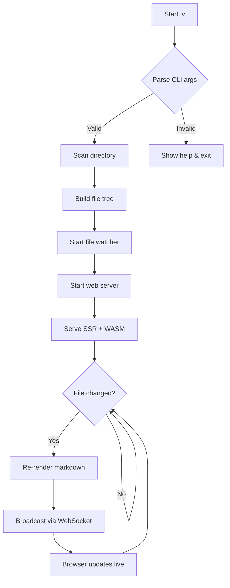
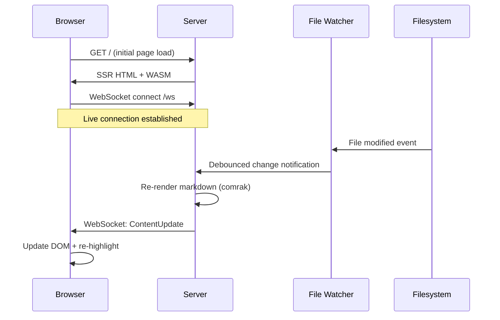
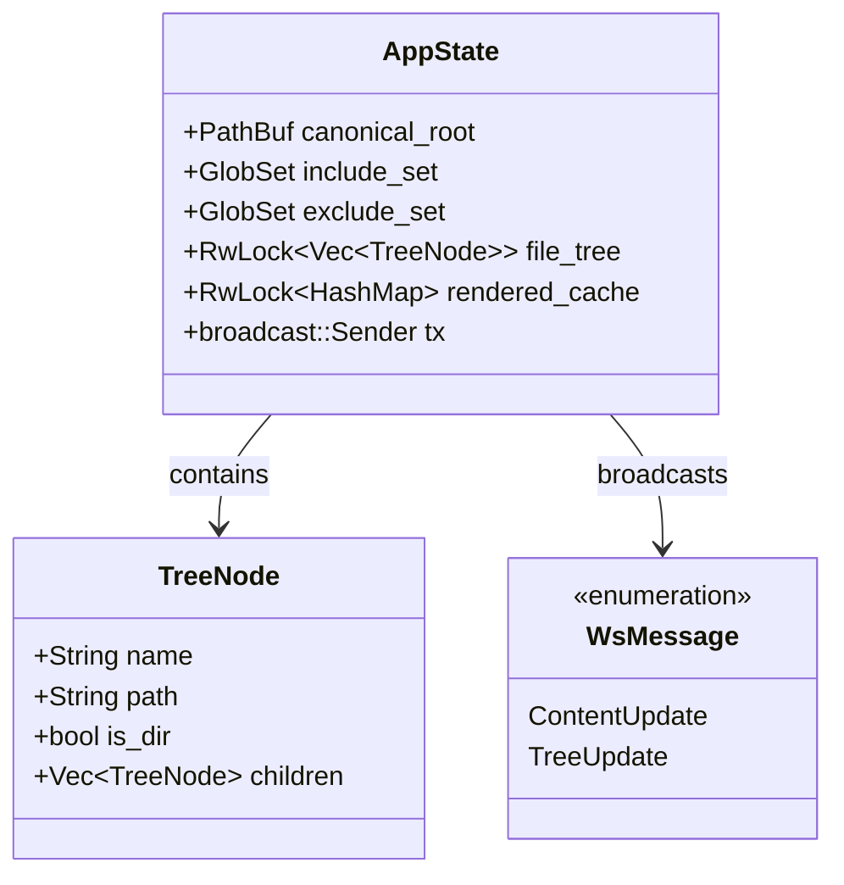
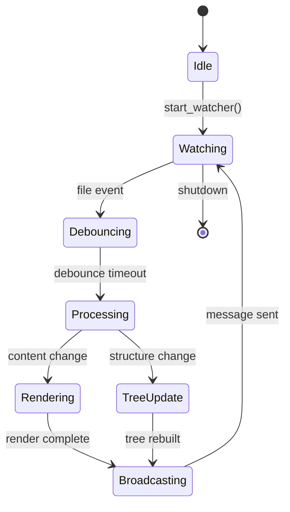
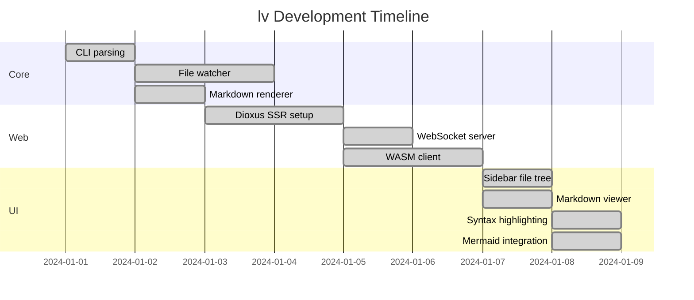
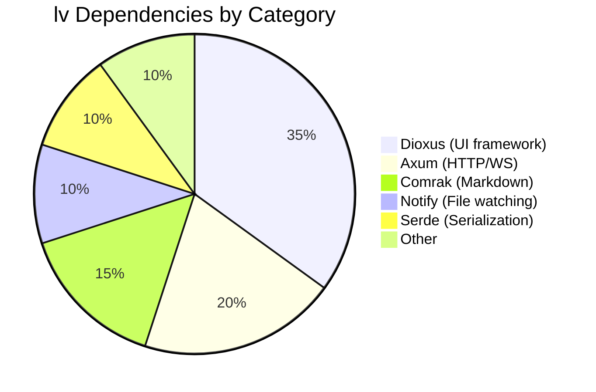
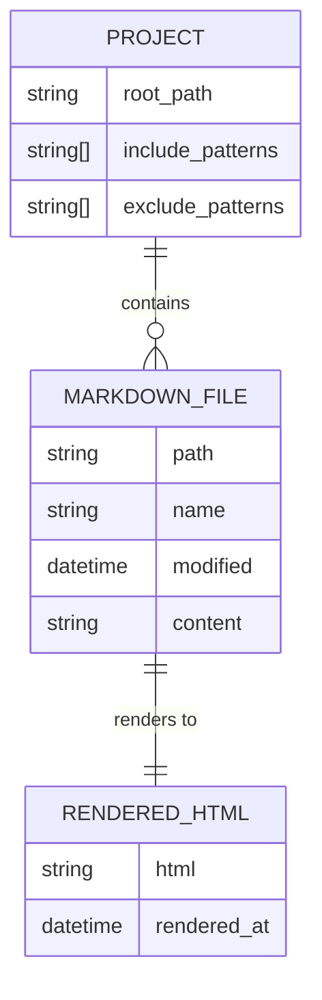

# Mermaid Diagrams

Testing mermaid.js rendering for various diagram types.

## Flowchart

## Sequence Diagram

## Class Diagram

## State Diagram

## Gantt Chart

## Pie Chart

## Entity Relationship

